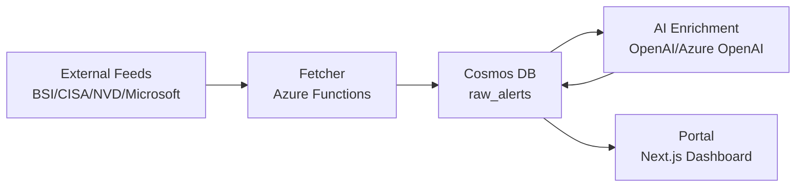

# Architecture Overview

CyberLage consists of a data ingestion layer (fetcher), an AI enrichment layer, and a portal for compliance-oriented threat visibility. The public release runs in single-tenant/demo mode.

For a compact intro, see `docs/SYSTEM_OVERVIEW.md`.

## Data Flow (Mermaid)

## Components

- **Fetcher (Azure Functions):** Aggregates feeds, normalizes alerts, enriches with CVSS/EPSS, writes to Cosmos DB.
- **AI Layer:** Generates summaries, prioritization context, and compliance tags (NIS2/DORA/GDPR).
- **Portal (Next.js):** Displays threat view, compliance relevance, and alert detail context.

## Decision Boundary (Deterministic vs AI)

- **Deterministic:** CVSS/EPSS parsing, source trust weighting, exploit flags, scoring schema.
- **AI-supported:** Summaries, compliance reasoning, action suggestions.

## Compliance Assessment Pipeline (6 Steps)

1. Alert ingestion (BSI/CISA/NVD/Microsoft)
2. Data enrichment (CVSS/EPSS, metadata)
3. Regulatory mapping (NIS2/DORA/GDPR)
4. Confidence scoring
5. Recommended actions
6. Auditability in the portal

## Data Model (Cosmos DB)

- `raw_alerts`: normalized alerts with enrichment
- `source_registry`: source configuration
- `fetch_logs`: fetch execution logs/errors

Recommended partitioning:
- `raw_alerts` by `sourceId`
- `fetch_logs` by `sourceId`

## Portal API Endpoints

- `GET /api/alerts` - filtered alert list
- `GET /api/alerts/:id` - alert details
- `GET /api/stats` - dashboard metrics
- `POST /api/chat` - AI analyst (internal data scope)

Note: tenant-specific endpoints are disabled/stubbed in public release.
