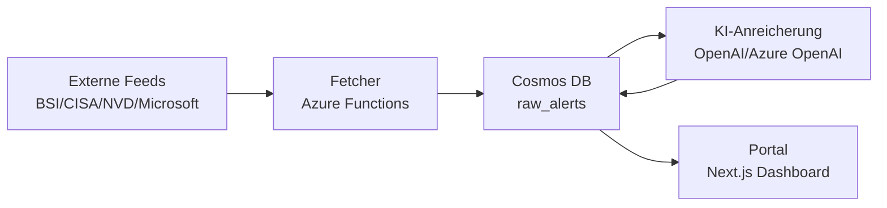

# Architekturübersicht

CyberLage besteht aus einem Daten-Ingestion-Layer (Fetcher), einer KI-Anreicherung und einem Portal zur Visualisierung der Compliance-Lage. Die öffentliche Version arbeitet im Single-Tenant-/Demo-Modus.

Für einen kompakten Einstieg siehe auch: `docs/SYSTEM_OVERVIEW.md`.

## Datenfluss (Mermaid)

## Komponenten

- **Fetcher (Azure Functions):** Aggregiert Feeds, normalisiert Alerts, ergänzt CVSS/EPSS und schreibt nach Cosmos DB.
- **KI-Layer:** Erzeugt Zusammenfassungen, Priorisierung und Compliance-Tags (NIS2/DORA/DSGVO).
- **Portal (Next.js):** Visualisiert Lagebild, Compliance-Relevanz und Details.

## Decision Boundary (Deterministisch vs. KI)

- **Deterministisch:** CVSS/EPSS-Parsing, Quell-Trust, Exploit-Flags, Scoring-Schemata.
- **KI-gestützt:** Zusammenfassung, Compliance-Einschätzung, Handlungsempfehlungen.

## Compliance-Assessment-Pipeline (6 Schritte)

1. **Alert-Ingestion** (BSI/CISA/NVD/Microsoft)
2. **Datenanreicherung** (CVSS/EPSS, CSAF, Metadaten)
3. **Regulatorischer Abgleich** (NIS2/DORA/DSGVO)
4. **Confidence-Scoring** (regulatorische Zuverlässigkeit)
5. **Handlungsempfehlung** (konkrete Maßnahmen)
6. **Audit-Trail** (Nachvollziehbarkeit im Portal)

## Datenmodell (Cosmos DB)

- `raw_alerts`: Normalisierte Alerts inkl. KI-Anreicherung
- `source_registry`: Konfiguration der Quellen
- `fetch_logs`: Laufzeiten/Fehler des Fetchers

Partitionierung (Empfehlung):
- `raw_alerts` nach `sourceId`
- `fetch_logs` nach `sourceId`

## API-Endpunkte (Portal)

- `GET /api/alerts` – Alerts mit Filtern
- `GET /api/alerts/:id` – Detailansicht
- `GET /api/stats` – Dashboard-Kennzahlen
- `POST /api/chat` – KI-Analyst (nur interne Daten)

Hinweis: Tenant-spezifische Endpunkte sind in der Public-Version entfernt/stubifiziert.
