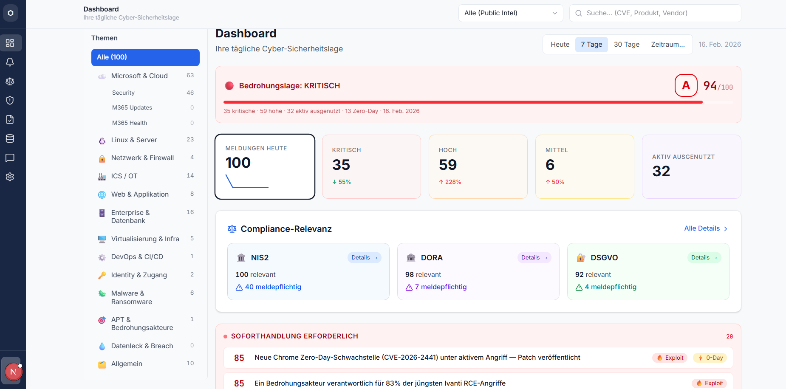
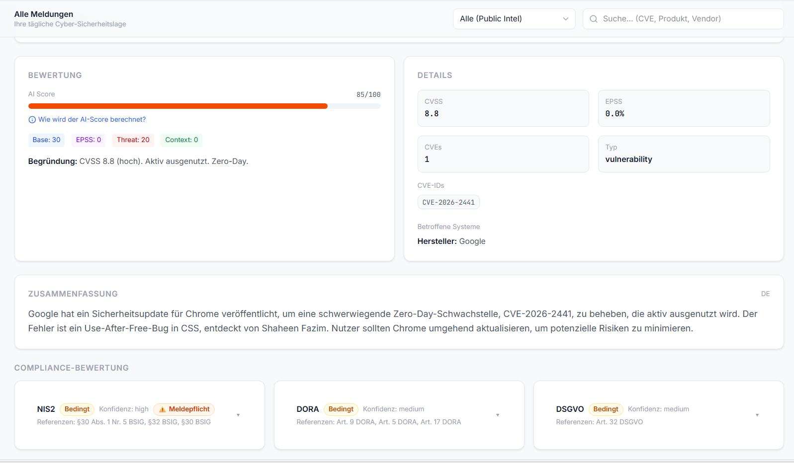
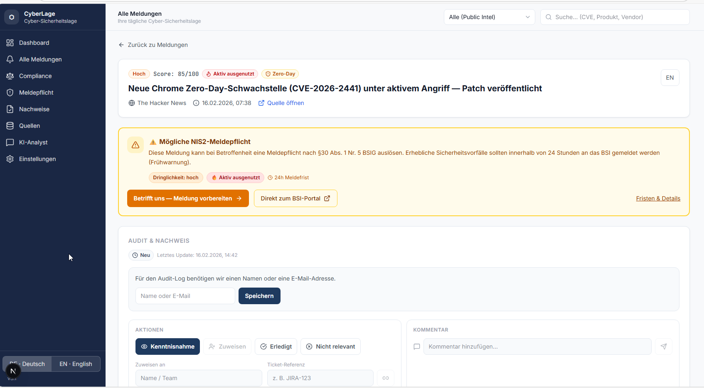
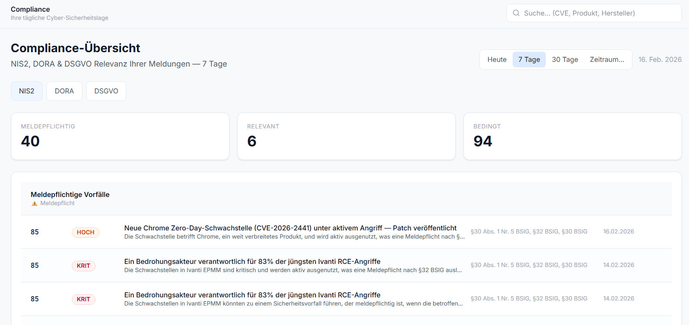
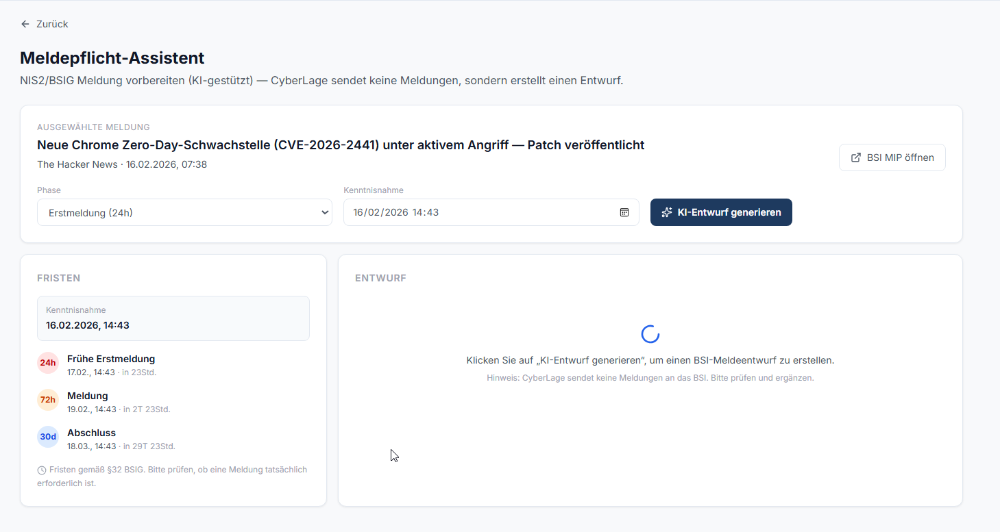
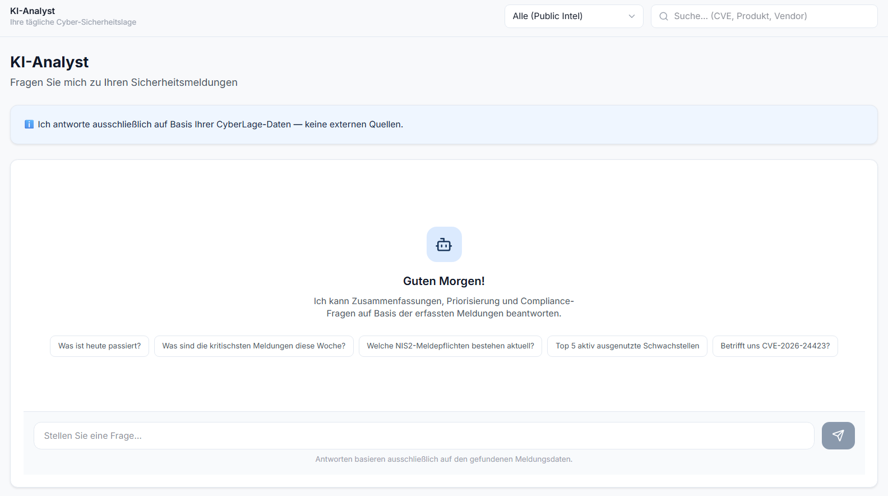

# CyberLage - German Cybersecurity Compliance Intelligence



## Language Versions

- English branch: [`main`](https://github.com/rashadbakirov/cyberlage/tree/main)
- German branch: [`public_release`](https://github.com/rashadbakirov/cyberlage/tree/public_release)

## Start Here

- Human deployment guide: `DEPLOYMENT_MIT_KI_AGENT.md`
- Agent zero-touch prompt: `docs/AGENT_ZERO_TOUCH_PROMPT.md`
- Required/optional inputs: `docs/ENVIRONMENT_MATRIX.md`
- Public release gate: `docs/PUBLIC_RELEASE_GATE.md`
- Documentation index: `docs/README.md`

## What Is CyberLage?

CyberLage is a compliance intelligence platform for the German/EU regulatory context. It aggregates security alerts from BSI, CISA, NVD, and Microsoft, enriches them with AI, and maps relevance to NIS2, DORA, and GDPR.

- Aggregates threat data from trusted public and enterprise sources
- AI-assisted summarization, prioritization, and compliance context
- Compliance mapping for NIS2, DORA, and GDPR
- Public release focused on a clear single-tenant demo workflow

## Problem

Security teams process high alert volumes every day. Only a subset is operationally critical or potentially reportable. Regulatory assessment is often manual, slow, and inconsistent.

## Solution

CyberLage turns alert noise into a structured operational view: normalized alerts, AI-supported context, and compliance indicators in one dashboard.

## Core Features

- Threat dashboard with priority signals
- AI summaries and analyst support
- Compliance indicators for NIS2, DORA, GDPR
- Trend and source visibility over time

## Repository Structure (Public)

- `cyberradar-fetcher`: Azure Functions for fetching, enrichment, and persistence
- `cyberradar-portal`: Next.js portal (dashboard, details, AI analyst)

## What You Get After Deployment

- Running app at `https://<WEBAPP_NAME>.azurewebsites.net`
- Dashboard, alerts, compliance radar, source view, AI analyst
- Reporting-assistant guidance with BSI links
- Public release scope without active tenant management/audit workflow

## Warning

- This repository is under active development.
- AI output can be wrong; always validate decisions and resources.
- Issues, pull requests, and forks are welcome.

## Quick Start

### Option A: Deploy With an AI Coding Agent (Recommended)

Use `DEPLOYMENT_MIT_KI_AGENT.md` and `tasks/README.md`.

The agent handles Azure resource setup and deployment. You provide subscription/resource group and optional Azure OpenAI/M365 details.

Quick prompt:

```text
I want to deploy CyberLage from this repo: [REPO_URL or PATH].
First read DEPLOYMENT_MIT_KI_AGENT.md, then tasks/README.md and all tasks in order.
Work step-by-step and ask me for missing info.

Resource Group: demo_cyberRadar_de
Subscription ID: <YOUR_SUBSCRIPTION_ID>
Azure OpenAI resource name: <YOUR_OPENAI_RESOURCE_NAME>
Name prefix (optional, default: cyberlage-demo-weu)

Microsoft 365 Enterprise App (optional, for Message Center & Service Health):
M365_TENANT_ID=<YOUR_TENANT_ID>
M365_CLIENT_ID=<YOUR_CLIENT_ID>
M365_CLIENT_SECRET=<YOUR_CLIENT_SECRET>

If Azure OpenAI cannot be created automatically, use:
AZURE_OPENAI_ENDPOINT=<YOUR_OPENAI_ENDPOINT>
AZURE_OPENAI_KEY=<YOUR_OPENAI_KEY>
AZURE_OPENAI_DEPLOYMENT=<YOUR_OPENAI_DEPLOYMENT>
```

Alternative one-liner (agent clones by itself):

```text
Clone this repository and deploy it end-to-end on Azure:
https://github.com/rashadbakirov/cyberlage.git
Use only the release setup docs: DEPLOYMENT_MIT_KI_AGENT.md and tasks/README.md.
Work interactively and ask for missing values.
Subscription ID: <YOUR_SUBSCRIPTION_ID>
Resource Group: <YOUR_RESOURCE_GROUP>
Azure OpenAI resource name: <YOUR_OPENAI_RESOURCE_NAME>
```

Zero-touch prompt:
- `docs/AGENT_ZERO_TOUCH_PROMPT.md`

### Option B: Manual Deployment

For full end-to-end behavior, Azure resources are required (Cosmos DB + Fetcher + Storage; OpenAI optional).

For Microsoft 365 Message Center/Service Health, an Entra app is required.

See `docs/DEPLOYMENT_MANUELL.md` for details.

Local UI start:

1. Copy `.env.example` to `.env` and fill values.
2. Install dependencies:

```bash
cd cyberradar-portal
npm install
```

3. Start dev server:

```bash
npm run dev
```

## Runtime Cadence

- Fetcher timer: every 10 minutes
- Enrichment timer: every 6 hours (up to 100 alerts/run)
- Demo seed data: `./scripts/seed-data.sh` or `pwsh -File scripts/seed-data.ps1`
- AI chat: uses OpenAI when configured; otherwise fallback mode

## Release Quality

- Gate checklist: `docs/PUBLIC_RELEASE_GATE.md`
- Acceptance tests: `docs/ACCEPTANCE_TESTS.md`
- Signoff protocol: `docs/PUBLIC_RELEASE_SIGNOFF.md`
- Hygiene checks:
  - `scripts/public-release-check.sh`
  - `scripts/public-release-check.ps1`

## Architecture

- Detailed: `ARCHITEKTUR.md`
- Quick overview: `docs/SYSTEM_OVERVIEW.md`

## Data Sources

- Full list: `docs/DATENQUELLEN.md`

## Infrastructure & Cost

- See `INFRASTRUKTUR.md`

## Screenshots

### Dashboard Overview


### Threat Details


### Threat Details (Extended)


### Compliance Radar


### Reporting Assistant


### AI Analysis


## Roadmap

- Full multi-tenant architecture for MSP scenarios
- Tenant-specific relevance filtering
- Automated reporting workflows (BSI/BaFin/DPA)
- CSAF/SBOM-based vulnerability management
- Microsoft Sentinel integration

## License

MIT License - see `LICENSE`.

## Support

If this project helps you, consider starring the repository.
