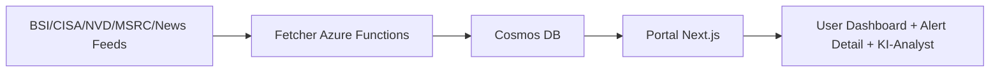

# System Overview (Public Release)

## Ziel

CyberLage liefert ein deutsches Cyber-Lagebild durch Aggregation, Anreicherung und Visualisierung von Security-Alerts.

## Komponenten

- `cyberradar-fetcher`:
  - Azure Functions für Fetching + Enrichment
  - schreibt in Cosmos DB
- `cyberradar-portal`:
  - Next.js UI + API
  - liest aus Cosmos DB und zeigt Lagebild/Details

Es gibt in dieser Public-Release-Struktur **kein** drittes produktives Projekt.

## Datenfluss

## Public Release Scope

- Aktiv:
  - Dashboard
  - Meldungen/Details
  - Compliance-Radar
  - Quellen
  - KI-Analyst
  - Meldepflicht-Hinweise
- Nicht aktiv:
  - Tenant-spezifische Betriebslogik
  - Audit/Nachweis-Workflow als aktive Public-Funktion

## Erwartetes Deployment-Ergebnis

- Vollständig laufende App unter:
  - `https://<WEBAPP_NAME>.azurewebsites.net`
