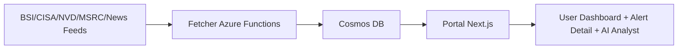

# System Overview (Public Release)

## Goal

CyberLage provides a cybersecurity situation picture by aggregating, enriching, and visualizing security alerts.

## Components

- `cyberradar-fetcher`:
  - Azure Functions for fetching and enrichment
  - writes to Cosmos DB
- `cyberradar-portal`:
  - Next.js UI and API
  - reads from Cosmos DB and presents dashboard/details

There is no third production project in this public release structure.

## Data Flow

## Public Release Scope

Active:
- Dashboard
- Alerts/details
- Compliance radar
- Sources
- AI analyst
- Reporting guidance

Inactive:
- Tenant-specific runtime logic
- Audit/evidence workflow as active public feature

## Expected Deployment Result

- Running application at:
  - `https://<WEBAPP_NAME>.azurewebsites.net`
